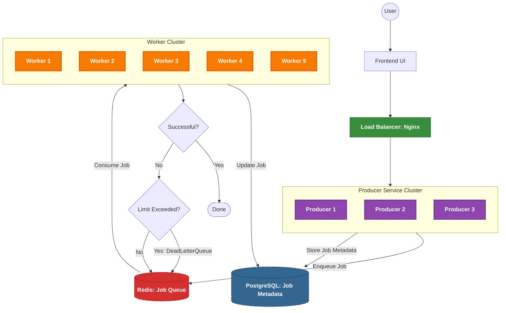

# Distributed Job Queue System with Redis and Spring Boot

## Overview

This project implements a scalable distributed job queue system using Redis and Spring Boot, designed to efficiently
distribute computational tasks across multiple worker nodes. The system provides robust job tracking, fault tolerance,
and handles job dependencies and failures gracefully.

### Requirements

* **Producer:**
    - Enqueue jobs with priorities and dependencies.
    - Track job statuses: Pending, Processing, Completed, Failed, and Canceled.
    - Support job cancellation and provide an API to revive dead jobs.
* **Worker:**
    - Deploy multiple worker nodes across different machines.
    - Dynamically scale based on queue length.
    - Track job progress and handle failures.
    - Use a Dead Letter Queue (DLQ) for unprocessable jobs.
    - Implement an automatic retry mechanism.
    - Provide monitoring APIs for worker system metrics.

## System Design



## Technical Specifications

* **Backend**: Spring Boot
* **Queue:** Redis
* **Load Balancer:** Nginx
* **Database:** PostgreSQL
* **Database Migration:** Liquibase

## Getting Started

### Prerequisites

* Java 21
* Maven
* Docker & Docker Compose

### Build and Run the Project

1. Clone the repository:
   ```bash
   git clone https://github.com/nadimnesar/distributed-job-queue-with-redis-and-spring.git
   cd distributed-job-queue-with-redis-and-spring
   ```

2. Start the services:
   ```bash
   make up
   ```

3. Stop the services:
   ```bash
   make down
   ```

### API Endpoints

Download the Postman collection and environment for testing the APIs.

[Postman Collection](docs/postman/distributed-job-queue.postman_collection.json)
[Postman Environment](docs/postman/distributed-job-queue.postman_environment.json)

### Logs

All logs are stored in the following directory: `docs/logs/`

Use the following commands to view logs in real-time:

```bash
# View log files for all producer instances
ls docs/logs/producer-*.log
# View logs for a specific producer instance
tail -f docs/logs/producer-local.log
```

## Future Enhancements

- [ ] Implement horizontal scaling for worker nodes based on queue length
- [ ] Improve job distribution algorithm for better worker utilization
- [ ] Implement job scheduling capabilities
- [ ] Implement Redis Cluster for high availability
- [ ] Add PostgreSQL replication for database redundancy
- [ ] Add advanced monitoring with Prometheus and Grafana

## Contributing

Contributions are welcome! Please feel free to submit a Pull Request.
